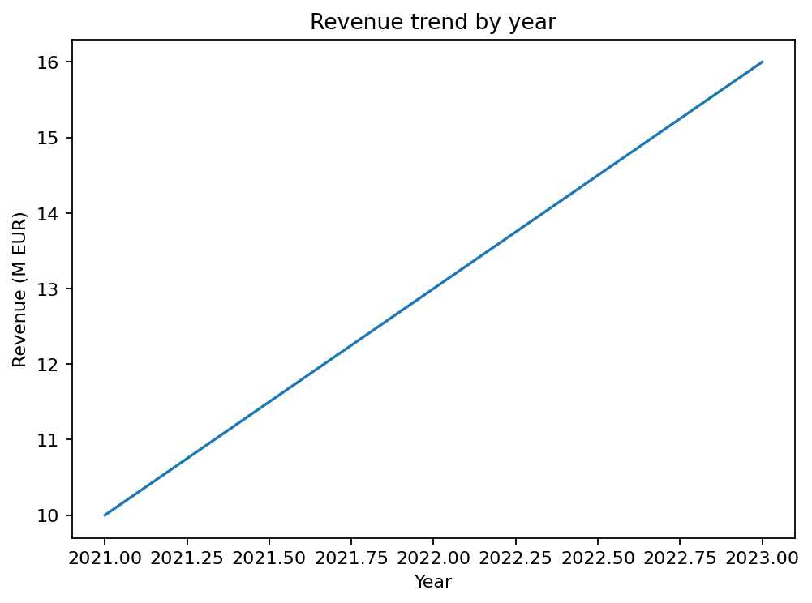

# GoldenViz

GoldenViz is a lightweight Python library for checking Matplotlib charts
against practical data visualization rules.

It is designed as a visual QA and teaching layer. GoldenViz does not create
charts for you; it inspects charts you already made and returns structured
feedback.

GoldenViz is inspired by the course and book:
[The 25 Golden Rules of Data Viz](https://www.goldenviz.org).

## Installation

```bash
pip install GoldenViz
```

Then import the package with the same capitalization:

```python
import GoldenViz as gv
```

## Quickstart

```python
import matplotlib.pyplot as plt
import GoldenViz as gv

fig, ax = plt.subplots()
ax.plot([2021, 2022, 2023], [10, 13, 16])
ax.set_title("Revenue trend by year")
ax.set_xlabel("Year")
ax.set_ylabel("Revenue (M EUR)")

gv.check(fig)
```

Running the code displays the Matplotlib chart first:

<p align="center">
  
</p>

Then GoldenViz renders an HTML report below it:

<div style="margin:16px 0 8px 0;border:1px solid #e4e7ec;border-radius:12px;padding:16px 18px;background:white;font-family:Inter,Segoe UI,Arial,sans-serif;text-align:left;">
  <div>
    <strong style="display:block;font-size:18px;color:#101828;">GoldenViz report</strong>
    <span style="display:block;font-size:13px;color:#475467;margin-top:4px;">Automatic visual QA for the 25 Golden Rules.</span>
  </div>
  <div style="display:flex;gap:10px;flex-wrap:wrap;margin-top:14px;">
    <span style="padding:4px 8px;border-radius:999px;background:#ecfdf3;color:#067647;font-weight:700;font-size:12px;">PASS 25</span>
    <span style="padding:4px 8px;border-radius:999px;background:#fffaeb;color:#b54708;font-weight:700;font-size:12px;">WARNING 0</span>
    <span style="padding:4px 8px;border-radius:999px;background:#fef3f2;color:#b42318;font-weight:700;font-size:12px;">FAIL 0</span>
  </div>
  <details open style="margin-top:14px;">
    <summary style="cursor:pointer;color:#475467;font-weight:700;font-size:13px;">View warnings and failures</summary>
    <div style="margin-top:12px;padding:10px 12px;border:1px solid #d0d5dd;border-radius:8px;background:#f8fafc;color:#101828;font-weight:700;font-size:14px;">Axis: Revenue trend by year</div>
    <div style="margin-top:8px;font-size:13px;color:#475467;">No warnings or failures for this axis.</div>
  </details>
  <details open style="margin-top:12px;">
    <summary style="cursor:pointer;color:#475467;font-weight:700;font-size:13px;">Passing checks (25)</summary>
    <table style="border-collapse:collapse;width:100%;font-size:13px;text-align:left;margin-top:8px;">
      <thead>
        <tr style="background:#f8fafc;">
          <th style="padding:8px 10px;border-bottom:1px solid #eaecf0;">Rule</th>
          <th style="padding:8px 10px;border-bottom:1px solid #eaecf0;">Status</th>
          <th style="padding:8px 10px;border-bottom:1px solid #eaecf0;">Assessment</th>
        </tr>
      </thead>
      <tbody>
        <tr>
          <td style="padding:8px 10px;border-top:1px solid #eaecf0;font-weight:600;">Clear title</td>
          <td style="padding:8px 10px;border-top:1px solid #eaecf0;"><span style="padding:2px 8px;border-radius:999px;background:#ecfdf3;color:#067647;font-weight:700;font-size:12px;">PASS</span></td>
          <td style="padding:8px 10px;border-top:1px solid #eaecf0;">Title detected: Revenue trend by year.</td>
        </tr>
        <tr>
          <td style="padding:8px 10px;border-top:1px solid #eaecf0;font-weight:600;">Axis labels</td>
          <td style="padding:8px 10px;border-top:1px solid #eaecf0;"><span style="padding:2px 8px;border-radius:999px;background:#ecfdf3;color:#067647;font-weight:700;font-size:12px;">PASS</span></td>
          <td style="padding:8px 10px;border-top:1px solid #eaecf0;">Both x-axis and y-axis labels are present.</td>
        </tr>
        <tr>
          <td style="padding:8px 10px;border-top:1px solid #eaecf0;font-weight:600;">Units and scale clarity</td>
          <td style="padding:8px 10px;border-top:1px solid #eaecf0;"><span style="padding:2px 8px;border-radius:999px;background:#ecfdf3;color:#067647;font-weight:700;font-size:12px;">PASS</span></td>
          <td style="padding:8px 10px;border-top:1px solid #eaecf0;">Numeric labels include detectable units or scale where applicable.</td>
        </tr>
      </tbody>
    </table>
    <div style="margin-top:8px;font-size:13px;color:#475467;">The full report contains all 25 passing checks.</div>
  </details>
</div>

The full report HTML fragment used in the documentation is available at
[`docs/_static/goldenviz_installation_check_report.html`](docs/_static/goldenviz_installation_check_report.html).

To get a structured report instead of displaying it:

```python
report = gv.analyze(fig)
print(report.summary_counts)
```

## Notebook auto mode

```python
import GoldenViz as gv

gv.auto()
```

When auto mode is enabled, GoldenViz tries to show a report after Matplotlib
figures are rendered in notebook workflows.

## Documentation

Full installation, usage, examples, API, citation, license, and trademark
information are available in the documentation:

https://goldenviz.readthedocs.io

## Project status

GoldenViz is currently an alpha package. The implementation is
Matplotlib-first, with Seaborn charts supported when they produce standard
Matplotlib axes.

GoldenViz uses heuristic checks. It can help detect common chart quality
issues, but it does not replace human judgment and may produce false positives
or false negatives.

See [CHANGELOG.md](CHANGELOG.md) for release notes.

## Development

From a local checkout:

```bash
pip install -e .
```

For documentation work:

```bash
pip install -e ".[docs]"
```

For tests:

```bash
pip install -e ".[test]"
pytest
```

## License

GoldenViz is free and open source software licensed under the GNU Affero General
Public License version 3 or later (`AGPL-3.0-or-later`). See [LICENSE](LICENSE).

Commercial licensing, enterprise use cases, hosted services, or integrations
that require terms different from AGPLv3 may be available by separate written
agreement.

GoldenViz and the GoldenViz logo are trademarks or claimed trademarks of Wajdi
Ben Saad. Use of the code under AGPLv3 does not grant permission to use the
GoldenViz name or logo to imply endorsement, official status, or partnership.
See [TRADEMARKS.md](TRADEMARKS.md).

## Contributing

Contributions are welcome. See [CONTRIBUTING.md](CONTRIBUTING.md) for the
development workflow and contribution licensing terms.
