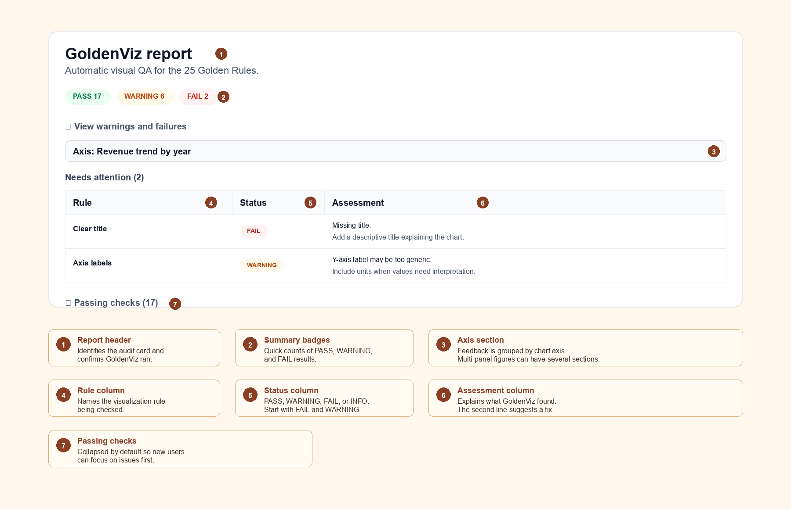

Quickstart
==========

GoldenViz can be used in three practical ways:

- Display a report for a specific figure with ``gv.check(fig)``.
- Display a report for the current Matplotlib figure with ``gv.check_current()``.
- Return structured Python results with ``gv.analyze(fig)``.

In notebooks, you can also enable automatic mode with ``gv.auto()`` so reports
appear below charts as you create them.

The 25 GoldenViz rules
----------------------

GoldenViz checks Matplotlib charts against 25 practical visualization rules.
The rule set is inspired by `The 25 Golden Rules of Data Viz
<https://www.goldenviz.org>`_ by Wajdi Ben Saad.

The rules are grouped into three families:

- ``Completeness``: the chart contains enough information to be understood.
- ``Readability``: the chart can be read and compared without unnecessary effort.
- ``Integrity``: the chart avoids misleading scale, encoding, or comparison choices.

.. raw:: html

   <table class="docutils align-default gv-rules-overview">
     <thead>
       <tr><th>Family</th><th>Rule</th><th>What GoldenViz checks</th></tr>
     </thead>
     <tbody>
       <tr>
         <td rowspan="6" class="gv-rule-family">Completeness</td>
         <td>1 - Clear title</td>
         <td>Checks whether the chart has a meaningful title that names the subject, metric, period, or main message, instead of leaving the reader to guess what the figure represents.</td>
       </tr>
       <tr>
         <td>2 - Axis labels</td>
         <td>Checks whether the x-axis and y-axis are labeled clearly enough to explain what the values or categories mean, including units when they are needed.</td>
       </tr>
       <tr>
         <td>3 - Units and scale clarity</td>
         <td>Checks whether numeric labels communicate scale and units, such as percentages, currency, counts, millions, or other measurement context.</td>
       </tr>
       <tr>
         <td>4 - Legend clarity</td>
         <td>Checks whether multi-series charts identify each series clearly, especially when several lines, colors, or categories appear in the same axis.</td>
       </tr>
       <tr>
         <td>5 - Annotation context</td>
         <td>Checks whether charts with important changes, many marks, or obvious events provide enough annotation or context for the reader to understand the takeaway.</td>
       </tr>
       <tr>
         <td>6 - Uncertainty cues</td>
         <td>Checks whether estimates or trends that may involve variability include uncertainty cues, such as error bars, bands, intervals, or similar context.</td>
       </tr>
       <tr>
         <td rowspan="10" class="gv-rule-family">Readability</td>
         <td>7 - Readable labels and ticks</td>
         <td>Checks for overlapping, crowded, tiny, excessive, or awkwardly rotated tick labels that make the chart difficult to read.</td>
       </tr>
       <tr>
         <td>8 - Color accessibility</td>
         <td>Checks whether color choices are likely to remain distinguishable, especially for categorical charts with many colors or low-contrast palettes.</td>
       </tr>
       <tr>
         <td>9 - Direct labeling</td>
         <td>Checks whether line charts or multi-series charts could be easier to read with direct labels instead of forcing repeated lookup in a legend.</td>
       </tr>
       <tr>
         <td>10 - Avoid chartjunk</td>
         <td>Checks for visual clutter such as heavy grids, excessive frames, decorative styling, or non-data ink that competes with the data.</td>
       </tr>
       <tr>
         <td>11 - Too many categories</td>
         <td>Checks whether categorical charts contain too many groups to compare comfortably, suggesting grouping, filtering, or focusing the view.</td>
       </tr>
       <tr>
         <td>12 - Sort categorical bars</td>
         <td>Checks whether bar charts with categorical values are ordered in a way that supports comparison, ranking, or scanning.</td>
       </tr>
       <tr>
         <td>13 - Scatter overplotting</td>
         <td>Checks whether scatter points overlap or repeat enough to hide density, suggesting transparency, aggregation, jitter, or size encoding.</td>
       </tr>
       <tr>
         <td>14 - Decimal precision</td>
         <td>Checks whether tick labels or annotations use unnecessary decimal precision that adds noise without improving interpretation.</td>
       </tr>
       <tr>
         <td>15 - Date axis formatting</td>
         <td>Checks whether date labels are readable, appropriately spaced, and formatted at a useful time granularity.</td>
       </tr>
       <tr>
         <td>16 - Visual economy</td>
         <td>Checks whether the chart uses more visual complexity than needed, such as redundant marks, excessive categories, or unnecessary encodings.</td>
       </tr>
       <tr>
         <td rowspan="9" class="gv-rule-family">Integrity</td>
         <td>17 - Appropriate scale</td>
         <td>Checks whether scales are valid and honest, especially whether bar charts start from zero unless a truncated baseline is clearly justified.</td>
       </tr>
       <tr>
         <td>18 - Chart type</td>
         <td>Checks whether the chosen chart type fits the data structure, such as avoiding line charts for unordered categories.</td>
       </tr>
       <tr>
         <td>19 - Color map quality</td>
         <td>Checks whether continuous color maps are perceptually reasonable and not misleading, especially avoiding problematic rainbow-style maps.</td>
       </tr>
       <tr>
         <td>20 - Avoid dual axes</td>
         <td>Checks for twin-axis charts that can imply false relationships because two unrelated scales are plotted together.</td>
       </tr>
       <tr>
         <td>21 - Area baseline</td>
         <td>Checks whether filled area charts use an honest baseline, because area size visually implies magnitude.</td>
       </tr>
       <tr>
         <td>22 - Aspect ratio sanity</td>
         <td>Checks whether the figure shape is extremely compressed or stretched in a way that exaggerates or hides trends.</td>
       </tr>
       <tr>
         <td>23 - Histogram bin quality</td>
         <td>Checks whether histogram bin choices are too coarse or too dense to show the distribution shape honestly.</td>
       </tr>
       <tr>
         <td>24 - Category color consistency</td>
         <td>Checks whether the same category keeps the same color across marks, avoiding accidental color/category contradictions.</td>
       </tr>
       <tr>
         <td>25 - Diverging zero reference</td>
         <td>Checks whether charts with positive and negative values make the zero reference clear enough for honest comparison.</td>
       </tr>
     </tbody>
   </table>

Manual report for a figure
--------------------------

Use ``gv.check(fig)`` when you have a Matplotlib figure object and want to show
the GoldenViz report immediately.

.. code-block:: python

   import matplotlib.pyplot as plt
   import GoldenViz as gv

   fig, ax = plt.subplots()
   ax.plot([2021, 2022, 2023], [10, 14, 13])
   ax.set_title("Revenue trend by year")
   ax.set_xlabel("Year")
   ax.set_ylabel("Revenue (M EUR)")

   gv.check(fig)

This is the safest starting point because you explicitly choose which figure
GoldenViz should inspect.

Manual report for the current chart
-----------------------------------

Use ``gv.check_current()`` when you just created a chart and want GoldenViz to
inspect the current active Matplotlib figure.

.. code-block:: python

   import matplotlib.pyplot as plt
   import GoldenViz as gv

   plt.plot([2021, 2022, 2023], [10, 14, 13])
   plt.title("Revenue trend by year")
   plt.xlabel("Year")
   plt.ylabel("Revenue (M EUR)")

   gv.check_current()

This is convenient in notebooks, but it depends on Matplotlib's current active
figure.

Automatic mode in notebooks
---------------------------

Use ``gv.auto()`` when you want GoldenViz to run automatically after charts are
rendered in Jupyter or VS Code notebooks.

.. code-block:: python

   import GoldenViz as gv

   gv.auto()

After automatic mode is enabled, create charts as usual. GoldenViz displays the
chart first, then appends a report below it.

.. code-block:: python

   import matplotlib.pyplot as plt

   fig, ax = plt.subplots()
   ax.plot([2021, 2022, 2023], [10, 14, 13])
   ax.set_title("Revenue trend by year")
   ax.set_xlabel("Year")
   ax.set_ylabel("Revenue (M EUR)")
   plt.show()

You can turn automatic mode off when you no longer want reports to appear:

.. code-block:: python

   gv.disable()

Structured analysis without display
-----------------------------------

Use ``gv.analyze(fig)`` when you want data you can inspect in Python instead of
an HTML report.

.. code-block:: python

   report = gv.analyze(fig)

   print(report.summary_counts)

The returned report contains one analysis section per chart axis. This mode is
useful for tests, scripts, dashboards, or custom reporting.

What the report shows
---------------------

GoldenViz reports are designed to be read from top to bottom:

- Start with the summary badges to see how many checks passed, warned, or failed.
- Read ``Needs attention`` first. These are the rules to fix before sharing the chart.
- Use the ``Assessment`` column as the explanation and quick repair suggestion.
- Open ``Passing checks`` only when you want to see what already looks good.

Report columns
--------------

.. list-table::
   :header-rows: 1
   :widths: 22 28 50

   * - Area
     - What it means
     - How to use it
   * - Rule
     - The visualization rule being checked.
     - Use it to identify the type of issue, such as title, axis labels, scale, or color.
   * - Status
     - The result of the check: ``PASS``, ``WARNING``, ``FAIL``, or ``INFO``.
     - Fix ``FAIL`` first, then review ``WARNING``. ``PASS`` means no obvious issue was found for that rule.
   * - Assessment
     - The message explaining what GoldenViz found.
     - Read the first line for the problem and the second line for a suggested improvement.
   * - Passing checks
     - Rules that did not raise a concern.
     - These are collapsed so beginners can focus on problems first.
